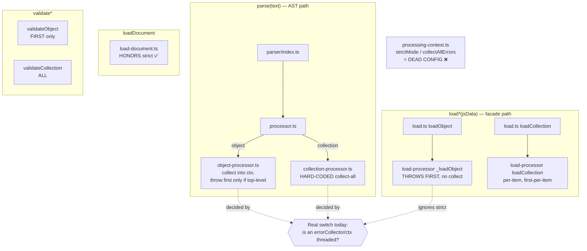

# ADR 0001 — strict options (validation mode + reader framing): full impact map, and why they are deferred

- **Status:** Accepted — **Deferred (parked) in the current version.** Retained as declared, non-functional options; to be activated in a later release.
- **Date:** 2026-08-12
- **Owner:** core/facade + streaming
- **Related:** io-test-cases `RECOMMENDATIONS.md` R3/R4/R5 · streaming ADRs `0001`, `0003`, `0007`, `0008` · streaming `PROTOCOL.md` §4/§5/§8 · `src/errors/FINALIZATION.md` (frozen error-code subset)
- **Scope:** This ADR is the single home for **all deferred strict options**: the core/facade
  **validation-error mode** (§1–§6, §8 appendix) and the **streaming reader's strict framing** (§7).

---

## TL;DR

`strict` is meant to pick between two error-handling modes: **collect-all** (default) and **fail-fast**
(`strict:true`). Today it is only honored in **one** internal file (`load-document.ts`). Everywhere else
the *actual* mode is decided by an unrelated accident of implementation — **whether an `errorCollector`
happens to be threaded, and whether you entered through `parse()` or `load*()`**. There are even **two
separate object processors** with opposite defaults, and the engine's own `strictMode`/`collectAllErrors`
config is **dead** (defined, never read).

Making `strict` real is a genuine cross-cutting change (new plumbing on the facade object path, a
public contract change to `validateObject`, and unifying the two processors). It is **not needed for the
current milestone** (the conformance corpus), so we **defer it** and document the whole surface here so it
can be picked up cold.

---

## 1. What `strict` is supposed to mean (the spec)

> "Implementations may provide modes for 'fail fast' … or 'parse all' … it is recommended to parse all
> items and report errors per item." — `the-collections/collection.md:131` (also `:125–143`,
> `the-collections/validation-rules.md:116–136`).

| `strict` | Intended contract |
|---|---|
| `false` (default) | **collect-all** — validate every field/item independently; one failure doesn't stop the rest; return all errors. |
| `true` | **fail-fast** — throw the first `ValidationError` and stop. |

Applies to **validation** errors only. **Syntax/structural** errors (unknown member in a closed schema,
duplicate member, positional-after-keyed, additional values) and **programmer/IO** errors (no schema
found, wrong argument type) are always fatal and out of scope for this toggle.

---

## 2. The problem in one picture — current behavior is inconsistent per entry point

For the **same** invalid data, what you get today depends on *how you entered* and *what shape* the data
is — not on `strict`:

| Entry point | Single object | Collection / array |
|---|---|---|
| **`parse(text, defs, collector)`** (text → Document) | collect-all into a `ProcessingContext`, transferred to `collector` | collect-all, **all** errors per item, pushed to `collector` + `collection.errors` |
| **`parse(text, defs)`** (no collector) | collects internally, then **throws the FIRST** error | collect-all (never throws for validation) |
| **`loadObject(jsData, defs)`** (JS → IO) | **throws the FIRST** error (no collection at all) | — |
| **`loadCollection(jsData, defs, collector)`** | — | per-item isolation, but **only the FIRST error *per item*** (because the object loader throws first) |
| **`load(...)` / `loadInferred(...)`** | same as `loadObject` | same as `loadCollection` |
| **`loadDocument(...)`** (`load-document.ts`) | **honors `strict`** (throw-first vs collect) — the *only* place it works | same |
| **`validateObject(obj, schema)`** | returns **only the FIRST** error | — |
| **`validateCollection(arr, schema)`** | — | returns **ALL** errors |

Three different "first-error vs all-errors" answers, and `strict` changes **none** of them except inside
`loadDocument`. That is the inconsistency we are choosing to document-and-defer rather than half-fix.

---

## 3. Full inventory — every place `strict`/validation-mode reaches in the library

### A. Public option surface (declared, mostly not read)
| Location | What it is | Reality |
|---|---|---|
| `facade/options.ts:34` | `IOCommonOptions.strict?` (JSDoc: PARKED) | shared type; **not read** by exported `load*` |
| `facade/load.ts:53,120,186` | `strict` documented on `LoadObjectOptions`/`LoadOptions` | JSDoc only; bodies never read it (`:107,:171,:248`) |
| `facade/load-inferred.ts:52` | `strict` on `LoadInferredOptions` | JSDoc only; `:103` ignores it |
| `facade/load-document.ts:38,41,145,202,224` | document loader's own `strict` | **Actually honored** — `if (options.strict) throw error; else collect`. The one working site. |

### B. The engine's mode config is **dead**
| Location | What it is | Reality |
|---|---|---|
| `schema/processing/processing-context.ts:9,15` | `collectAllErrors?` / `strictMode?` fields | **Defined, never read anywhere** (grep-confirmed). |
| `processing-context.ts:29–30,38–46` | defaults `collectAllErrors:true`, `strictMode:false`; getters | Getters exist; no code consults them. Pure dead config. |

The engine's *real* collect-vs-throw decision is **not** these flags — it's whether a `ProcessingContext`
is threaded (see C).

### C. The **two object processors** (the core divergence)
| Location | Path | Behavior |
|---|---|---|
| `schema/object-processor.ts:61,92,131,329,337` | **parser/AST** path (via `parse` → `processSchema`) | `ctx = context ?? new ProcessingContext()`. Collects all validation errors into `ctx`. **Only throws the first error if `isTopLevel`** (i.e. no context was passed). Syntax errors (`:208,:228,:236,:243`) throw immediately. |
| `schema/load-processor.ts:_loadObject (112–197)` | **facade JS-data** path (via `loadObject`) | A *separate, simpler* implementation that **throws on the first** validation error (`:141,:150,:188`). No context, no collection. |
| `schema/processor.ts:32–47` | dispatcher for the parser path | For objects, if `errorCollector` given, builds a `ProcessingContext`, runs `processObject`, transfers `ctx.getErrors()` → collector. Otherwise runs top-level (throws first). |
| `schema/processing/collection-processor.ts:43–95` | parser collection path | Per item: fresh `ProcessingContext`, collect **all**, build `ErrorNode`, push to `errorCollector` + `collection.errors`. **Hard-coded collect-all** — `strict` never consulted. |
| `schema/load-processor.ts:loadCollection (223–289)` | facade JS collection path | Loops `loadObject` in try/catch → per-item isolation, but inherits _loadObject's **first-error-per-item**. |

**De-facto rule today:** *pass an `errorCollector`/context → you collect; don't → you throw the first.*
That, not `strict`, is the real switch.

### D. `validate*` divergence
| Location | Behavior |
|---|---|
| `facade/validate.ts:52–60` | `validateObject`: `try { loadObject } catch { errors.push(one) }` → **first error only** |
| `facade/validate.ts:73–86` | `validateCollection`: passes `errors[]` to `loadCollection` → **all errors** |

### E. Parser `continueOnError` — the inert cousin
| Location | Reality |
|---|---|
| `parser/parser-options.ts:3,25` | `continueOnError?` declared, stored | 
| `parser/index.ts:59` | `'continueOnError' in defs` routed into options | flag drives **no behavior** — inert. Must be wired (parser-stage `strict:false`) or removed. |

### F. Streaming — has its **own** decided posture (delegates semantics to core)
| Location | Reality |
|---|---|
| `src/streaming/specs/decisions/0001-delegate-semantics-to-core.md` | streaming never redefines core semantics; same value + error identity as core |
| `.../0007-first-validation-error-in-envelope.md` | a streamed record's envelope surfaces the **first** validation error by design |
| `.../0008-recoverable-vs-fatal-errors.md` | streaming's recoverable-vs-fatal split |
| Impact | When core's mode is unified, re-check these ADRs for consistency, but streaming is **not blocked** by this deferral and needs no change now. |

### G. Adjacent & bundled — `skipErrors` (output side, R5-A)
Not a validation mode, but the same "uniform error handling" theme, so tracked together:
| Location | Reality |
|---|---|
| `core/collection.ts:215–221`, `core/document.ts:109`, `facade/stringify.ts:404`, `facade/stringify-document.ts:312`, `facade/to-object.ts:5,21` | `skipErrors` honored (omits error placeholders on output) |
| `core/section.ts:92` + `core/internet-object.ts` `toObject()` | **Gap:** object sections drop `skipErrors` because `IOObject.toObject()` takes no options. Fix in the same pass. |

### H. Explicitly OUT of scope (false positives on the word "strict")
- `schema/types/decimal.ts:30,104` and `schema/types/number-old.ts:187,323` — "Strict validation" there
  means exact `DECIMAL(precision, scale)` checking, unrelated. (`number-old.ts` is dead code.)
- `schema/parse-schema.ts:28` — a comment ("keep behavior strict"); unrelated.

---

## 4. Impact / ripple if we wire it now (why it is not a one-liner)

1. **New plumbing on the facade object path.** `loadObject` (`load.ts:107`) → `_loadObject` throws first
   with no collector. To honor the default `strict:false` (collect-all) it must gain a
   `ProcessingContext`/collector — ideally by **routing through `object-processor.ts` instead of the
   duplicate `_loadObject`**, collapsing the two processors. That is the largest single piece.
2. **Public contract change to `validateObject`.** Unifying it to collect-all changes its return from
   `errors:[first]` to `errors:[…all]` — a semver-worthy behavior change needing a `CHANGELOG` note.
3. **`toObject`/`toJSON` defaults must not move** while adding `skipErrors` to object sections — these are
   called nearly everywhere; the default output must stay byte-identical (guarded by tests).
4. **Kill the dead engine config or make it real.** Either wire `strictMode`/`collectAllErrors` as the
   single internal switch, or delete them so they stop implying a capability that isn't there.
5. **Resolve `continueOnError`.** Wire as parser-stage `strict:false`, or remove.
6. **Re-verify streaming** against ADRs 0007/0008 after core unifies (no change expected, but confirm).

Blast radius: **medium**, concentrated in facade object-path plumbing and the `validateObject` contract.

---

## 5. Decision for the current version

- **Defer.** Ship `strict` as a **declared but non-functional** option (retained on `IOCommonOptions`), so
  activating it later is **non-breaking**.
- **Document** the whole surface (this ADR) and mark the option PARKED in JSDoc (`facade/options.ts:34`).
- **Do not** touch the two-processor divergence, `validate*`, `continueOnError`, or the dead engine config
  in this release.
- Rationale: the real cost is cross-cutting plumbing + a public contract change, none of which the current
  conformance-corpus milestone needs. A correct, tested `strict` later beats a partial one now.

## 6. Activation plan (when un-parked) & acceptance criteria

**Order (do it as one contract):**
1. Route facade `loadObject` through the ctx-collecting `object-processor.ts`; retire/merge `_loadObject`.
2. Thread `options.strict` → `ProcessingContext` (map to fail-fast; default collect-all) across
   `loadObject`/`loadCollection`/`load`/`loadInferred`.
3. Unify `validateObject` onto the same collector path as `validateCollection` (version the change).
4. Wire or delete `continueOnError`.
5. Add `IOObject.toObject({skipErrors?})`; forward from `section.ts` (default unchanged) — closes R5-A.
6. Make `strictMode`/`collectAllErrors` the single real internal switch, or delete them.
7. Flip `options.strict` JSDoc from PARKED to live; mark this ADR *Superseded — implemented*.

**Tests to add:** collection with one bad item → `strict:true` throws first, `strict:false` returns
all-with-errors; single object → both modes (proves new object plumbing); `validateObject` on a
multi-error object → all errors; `validateObject`/`validateCollection` parity; object-section
`toObject({skipErrors:true})` drops placeholders with default unchanged; `continueOnError` as decided;
regression: existing default `load*` behavior unchanged unless opted in.

**Done when:** `strict` observably changes behavior on all four `load*`; `validate*` share one collect-all
contract (documented in `CHANGELOG.md`); no inert `continueOnError`/dead engine config remains;
`skipErrors` uniform; full suite green.

---

## 7. Streaming reader framing — strict vs lenient (v1: lenient)

The streaming reader has its own strict-vs-lenient question, distinct from the validation-error mode in
§1–§6 but parked under this same "strict options" umbrella. Two reader behaviors are currently **lenient**,
and both **conform** to the streaming spec — they are permitted leniencies, not gaps:

| Behavior (lenient, today) | Spec basis |
|---|---|
| A stream with **no `---` terminator** is buffered to end-of-stream and reinterpreted as headerless data records. | `PROTOCOL.md` §4: a reader **MAY** accept the legacy form that "begins directly with `~` data and contains no `---`" (see streaming ADR `0003`). This is the same path that lets a producer stream raw IO data without a header. |
| A **midstream `~ $Foo: {…}`** (after the header phase) is parsed as an ordinary data record and **cannot** mutate the frozen definitions state. | `PROTOCOL.md` §5: "there is no normative midstream definition-mutation syntax." §8 places the "MUST NOT emit" obligation on the *writer*, not the reader. |

**Decision:** keep the reader **lenient** in v1. Defer an opt-in **strict reader mode** — e.g.
`createStreamReader(src, defs, { strict: true })` that (a) rejects the no-`---` legacy form and (b) surfaces
a clear error for a midstream definition-looking record — to this same future strict-options effort.

**Why independent of §1–§6:** this touches only `src/streaming/reader.ts` (framing/lifecycle), not the
core/facade validation plumbing or the `validate*` contract. It has no cross-cutting blast radius and is
not blocked by the core unification above. When built, strict mode **must be opt-in** so it never regresses
the lenient default (which preserves headerless input).

**Acceptance (when un-parked):** `strict:true` rejects a no-`---` stream with a clear framing error;
`strict:true` surfaces one clear error at a midstream `~ $Name:` definition attempt; the default (lenient)
behavior and every streaming conformance case remain unchanged; tests cover both modes.

### 7.1 Validation-handling issues in the streaming reader (audit)

Reading `reader.ts` against the error ADRs, per-record validation flows through the **core** path —
`emitFrame` calls `parse(text, activeSchema, errors)` with an `errors` collector (`reader.ts:161–166`),
so value/error *identity* matches core (ADR `0001`). The *surfacing* layer, however, has issues:

| # | Finding | Location | Nature |
|---|---|---|---|
| **S1** | The `record-error` envelope carries only the **first** validation error, even though `parse()` collected **all** of them into the frame's `errors[]`. `StreamItem` has `error: Error` (singular) — no channel for the rest. | `reader.ts:152–153,196`; `types.ts:42`; ADR `0007` | **Deferred design** — directly conflicts with the §1–§6 collect-all direction. |
| **S2** | Header/definition parse errors were collected into `headerErrors` but **never inspected or surfaced**; additionally, a `---` masked by an unclosed brace routed the whole stream through the legacy flush, where the header error was **demoted to a recoverable record-error**. | `reader.ts` `processHeader` + `emitFrame` | **FIXED** (2026-08-13) — both paths now fatal per PROTOCOL §7.2; see streaming ADR `0012` and `tests/streaming/header-errors-fatal.test.ts`. Not part of this deferral. |
| **S3** | A record with recoverable validation errors collapses to `record-error` with `data:null` — the partially-processed value is dropped (no data-with-errors option). | `reader.ts:153`; `collection-processor.ts:63`; `types.ts:41` | Design choice (ADR `0007`); recorded. |
| **S4** | Syntax/structural errors inside a frame are caught (`try/catch`) and **downgraded to a recoverable `record-error`**; the stream continues. Core treats those same errors as **fatal throws**. Error identity is preserved; *fatality* differs. | `reader.ts:167–168`; ADRs `0008`, `0001` | Intentional streaming leniency — **confirm** no genuinely-fatal (stream-structural) error leaks out as a mere record-error. |
| **S5** | `errorOf` returns `x` as-is when it is neither an `ErrorNode` nor carries `originalError`, so a non-`Error` could populate `error: Error`. Unlikely on the AST path (parse yields `ErrorNode`), but the envelope's type contract isn't guaranteed. | `reader.ts:143–147` | Minor robustness. |

**Decision:**
- **S1 + S3** remain ADR `0007`'s v1 contract (single error, no data). When core unifies to collect-all (§6),
  **re-decide S1**: either re-affirm single-error-in-envelope as a deliberate streaming exception, or extend
  `StreamItem` with an optional `errors?: Error[]` richer channel (ADR `0007` already reserves "a separate
  channel"). Changed only in `reader.ts` / `types.ts` — no core blast radius.
- **S4** is spec-sanctioned (ADR `0008`) but should be **re-confirmed** with an explicit test that a fatal
  stream error is never silently demoted to a record-error.
- **S2 was a bug independent of this deferral — now FIXED** (streaming ADR `0012`): the reader throws the
  first collected header error (fatal, core identity preserved), and the legacy no-`---` flush rethrows
  parse failures of `---`-bearing frames instead of demoting them to record-errors. Covered by
  `tests/streaming/header-errors-fatal.test.ts`.

**Impact on §1–§6:** none blocking. Streaming delegates value/error *identity* to core; only the *surfacing
shape* (single vs multi error) is a streaming-local choice.

### 7.2 Cross-check with error finalization (`src/errors/FINALIZATION.md`)

The error-code finalization tracker constrains and confirms the above:

- **S1 is real, not hypothetical.** A frozen conformance case, `multi-validation-error-one-item.json`
  (freezing `not-a-string`), proves core **collects multiple validation errors for a single item**. So the
  extra errors the streaming envelope drops (S1) demonstrably exist — this is truncation, not absence.
- **S4 is already pinned by conformance, not unconfirmed.** The recoverable/fatal split is frozen:
  `expecting-bracket` (syntax) is **recoverable** via `recoverable-parse-error.json`; `schema-not-defined`
  is **fatal** via `unknown-schema-switch-fatal.json`. So streaming's "syntax-error-in-a-frame is a
  recoverable record-error" is a tested contract. Reframe S4's action: don't *demote a fatal* error, and
  don't let strict-wiring **recategorize** these codes.
- **Hard constraint on the §6 activation plan.** Wiring `strict` / unifying `validate*` must **not** rename,
  remove, or recategorize any **frozen-by-reference** code (`expecting-bracket`, `not-a-string`,
  `schema-not-defined`) nor change the class/condition that produces it — per FINALIZATION.md's protecting
  invariant. In particular, moving `validateObject` to collect-all must keep each error's existing
  class/category (`IOValidationError` / `validation`) intact.
- **Independent, already-resolved note:** FINALIZATION.md records that a boolean-validator misclassification
  had been *short-circuiting collected validation errors* (now fixed). That was the same collect-all
  machinery §1–§6 depends on — worth knowing the core path is now clean.

This ADR (validation **mode**: collect vs fail-fast, and surfacing shape) and FINALIZATION.md (error
**code** registry/classification) are complementary and must stay mutually consistent.

---

### Data flow — where `strict` lives vs. where the mode is *actually* decided today

