# Type System Enhancement - Quick Reference Card

## Overview

Quick reference for implementing load/serialize operations with abstracted validation across all TypeDefs.

## Core Concepts

```mermaid
graph TB
    A[TypeDef Interface] --> B[parse: Text → JS]
    A --> C[load: JS → Validated JS]
    A --> D[serialize: JS → Text]
    B --> E[validateValue]
    C --> E
    D --> E
    E --> F[Shared Validation Logic]

    style A fill:#e1f5ff
    style E fill:#fff3cd
    style F fill:#d4edda
```



## Operations Comparison

| Operation | Input | Output | Use Case |
|-----------|-------|--------|----------|
| **parse** | IO Text (Node) | JS Value | Deserialize IO format |
| **load** | JS Value | Validated JS Value | Validate JS objects |
| **serialize** | JS Value | IO Text | Convert JS to IO format |
| **validate** | JS Value | Validated Value | Core validation logic |

## Data Flow


## TypeDef Implementation Pattern


## Validation Architecture


## Implementation Checklist

### Phase 1: Refactor Common Type Check ✅


- [ ] Change `{ value, changed }` → `{ value, handled }`
- [ ] Update all callsites in TypeDefs
- [ ] Run tests after each file
- [ ] Verify no regressions

### Phase 2: Extract Validation ✅


**For each TypeDef:**
- [ ] Create `private validateValue()` method
- [ ] Move constraint checks into it
- [ ] Keep type checks in `parse()`
- [ ] Add JSDoc comments
- [ ] Write validation tests

### Phase 3: Implement Load 🚀


**For each TypeDef:**
- [ ] Add `load(value, memberDef, defs?)` method
- [ ] Type check: `typeof value === 'expectedType'`
- [ ] Call `doCommonTypeCheck()`
- [ ] Call `validateValue()`
- [ ] Test all constraints
- [ ] Test error cases

### Phase 4: Enhance Serialize ✅


**For each TypeDef:**
- [ ] Validate before serialization
- [ ] Handle null → `'N'`
- [ ] Handle undefined → `''` or error
- [ ] Format using existing logic
- [ ] Test validation catches errors

### Phase 5: Integration ✅

- [ ] Create `loadObject()` function
- [ ] Update high-level API
- [ ] Write integration tests
- [ ] Document new features
- [ ] Performance benchmarks

## Code Templates

### Template: StringDef Structure

```typescript
class StringDef implements TypeDef {
  // ===== PUBLIC API =====

  parse(node: Node, memberDef: MemberDef, defs?: Definitions): string {
    const valueNode = defs?.getV(node) || node
    const { value, handled } = doCommonTypeCheck(memberDef, valueNode, node, defs)
    if (handled) return value

    // Type check (parse-specific)
    if (!(valueNode instanceof TokenNode) || valueNode.type !== TokenType.STRING) {
      throw new ValidationError(ErrorCodes.notAString, ...)
    }

    return this.validateValue(valueNode.value, memberDef, node)
  }

  load(value: any, memberDef: MemberDef, defs?: Definitions): string {
    const { value: checked, handled } = doCommonTypeCheck(memberDef, value, undefined, defs)
    if (handled) return checked

    // Type check (load-specific)
    if (typeof value !== 'string') {
      throw new ValidationError(ErrorCodes.notAString, ...)
    }

    return this.validateValue(value, memberDef)
  }

  serialize(value: any, memberDef: MemberDef, defs?: Definitions): string {
    const { value: checked, handled } = doCommonTypeCheck(memberDef, value, undefined, defs)
    if (handled) {
      if (checked === null) return 'N'
      if (checked === undefined) return ''
    }

    const validated = this.validateValue(value, memberDef)
    return this.formatToIOText(validated, memberDef)
  }

  // ===== PRIVATE METHODS =====

  private validateValue(value: string, memberDef: MemberDef, node?: Node): string {
    // Pattern validation
    this.validatePattern(memberDef, value, node)

    // Length validation
    if (memberDef.len !== undefined && value.length !== memberDef.len) {
      throw new ValidationError(ErrorCodes.invalidLength, ...)
    }

    if (memberDef.maxLen !== undefined && value.length > memberDef.maxLen) {
      throw new ValidationError(ErrorCodes.invalidMaxLength, ...)
    }

    if (memberDef.minLen !== undefined && value.length < memberDef.minLen) {
      throw new ValidationError(ErrorCodes.invalidMinLength, ...)
    }

    return value
  }

  private validatePattern(memberDef: MemberDef, value: string, node?: Node): void {
    // Pattern validation logic
  }

  private formatToIOText(value: string, memberDef: MemberDef): string {
    // Format based on memberDef.format
  }
}
```

### Template: NumberDef Structure

```typescript
class NumberDef implements TypeDef {
  parse(node: Node, memberDef: MemberDef, defs?: Definitions): number {
    const valueNode = defs?.getV(node) || node
    const { value, handled } = doCommonTypeCheck(memberDef, valueNode, node, defs)
    if (handled) return value

    // Type-specific validation
    return this.validateValue(value, memberDef, node)
  }

  load(value: any, memberDef: MemberDef, defs?: Definitions): number {
    const { value: checked, handled } = doCommonTypeCheck(memberDef, value, undefined, defs)
    if (handled) return checked

    // Type check with optional coercion
    if (typeof value === 'string') {
      const parsed = Number(value)
      if (isNaN(parsed)) {
        throw new ValidationError(ErrorCodes.invalidType, ...)
      }
      value = parsed
    }

    if (typeof value !== 'number') {
      throw new ValidationError(ErrorCodes.invalidType, ...)
    }

    return this.validateValue(value, memberDef)
  }

  serialize(value: any, memberDef: MemberDef, defs?: Definitions): string {
    const { value: checked, handled } = doCommonTypeCheck(memberDef, value, undefined, defs)
    if (handled) {
      if (checked === null) return 'N'
      if (checked === undefined) return ''
    }

    const validated = this.validateValue(value, memberDef)
    return this.formatToIOText(validated, memberDef)
  }

  private validateValue(value: number, memberDef: MemberDef, node?: Node): number {
    // Range validation
    const min = memberDef.min ?? this.getTypeBounds(this._type).min
    const max = memberDef.max ?? this.getTypeBounds(this._type).max

    if ((min !== null && value < min) || (max !== null && value > max)) {
      throw new ValidationError(ErrorCodes.invalidRange, ...)
    }

    // MultipleOf validation
    if (memberDef.multipleOf !== undefined && value % memberDef.multipleOf !== 0) {
      throw new ValidationError(ErrorCodes.invalidValue, ...)
    }

    return value
  }

  private formatToIOText(value: number, memberDef: MemberDef): string {
    if (memberDef.format === 'hex') return '0x' + value.toString(16)
    if (memberDef.format === 'octal') return '0o' + value.toString(8)
    if (memberDef.format === 'binary') return '0b' + value.toString(2)
    if (memberDef.format === 'scientific') return value.toExponential()
    return value.toString()
  }
}
```

### Template: ArrayDef Structure

```typescript
class ArrayDef implements TypeDef {
  parse(node: Node, memberDef: MemberDef, defs?: Definitions): any[] {
    const valueNode = defs?.getV(node) || node
    const { value, handled } = doCommonTypeCheck(memberDef, valueNode, node, defs)
    if (handled) return value

    if (!(valueNode instanceof ArrayNode)) {
      throw new ValidationError(ErrorCodes.notAnArray, ...)
    }

    // Get item type definition
    const itemTypeDef = this.getItemTypeDef(memberDef)
    const array: any[] = []

    // Parse each item
    for (const item of valueNode.children) {
      array.push(itemTypeDef.parse(item, memberDef.of, defs))
    }

    // Validate length
    this.validateLength(array, memberDef)
    return array
  }

  load(value: any, memberDef: MemberDef, defs?: Definitions): any[] {
    const { value: checked, handled } = doCommonTypeCheck(memberDef, value, undefined, defs)
    if (handled) return checked

    if (!Array.isArray(value)) {
      throw new ValidationError(ErrorCodes.notAnArray, ...)
    }

    // Get item type definition
    const itemTypeDef = this.getItemTypeDef(memberDef)
    const array: any[] = []

    // Load each item
    for (let i = 0; i < value.length; i++) {
      array.push(itemTypeDef.load(value[i], memberDef.of, defs, i))
    }

    // Validate length
    this.validateLength(array, memberDef)
    return array
  }

  serialize(value: any, memberDef: MemberDef, defs?: Definitions): string {
    const { value: checked, handled } = doCommonTypeCheck(memberDef, value, undefined, defs)
    if (handled) {
      if (checked === null) return 'N'
      if (checked === undefined) return ''
    }

    if (!Array.isArray(value)) {
      throw new ValidationError(ErrorCodes.notAnArray, ...)
    }

    this.validateLength(value, memberDef)

    const itemTypeDef = this.getItemTypeDef(memberDef)
    const serialized = value.map(item => itemTypeDef.serialize(item, memberDef.of, defs))

    return `[${serialized.join(', ')}]`
  }

  private validateLength(array: any[], memberDef: MemberDef): void {
    const len = array.length

    if (memberDef.len !== undefined && len !== memberDef.len) {
      throw new ValidationError(ErrorCodes.invalidLength, ...)
    }

    if (memberDef.minLen !== undefined && len < memberDef.minLen) {
      throw new ValidationError(ErrorCodes.outOfRange, ...)
    }

    if (memberDef.maxLen !== undefined && len > memberDef.maxLen) {
      throw new ValidationError(ErrorCodes.outOfRange, ...)
    }
  }
}
```

## Testing Patterns

### Test Structure


### Test Template

```typescript
describe('StringDef', () => {
  const stringDef = new StringDef()

  describe('parse', () => {
    it('should parse valid string token', () => {
      const node = createStringToken('hello')
      const memberDef: MemberDef = { type: 'string', path: 'test' }
      expect(stringDef.parse(node, memberDef)).toBe('hello')
    })
  })

  describe('load', () => {
    it('should load valid string', () => {
      const memberDef: MemberDef = { type: 'string', path: 'test' }
      expect(stringDef.load('hello', memberDef)).toBe('hello')
    })

    it('should throw on non-string', () => {
      const memberDef: MemberDef = { type: 'string', path: 'test' }
      expect(() => stringDef.load(123, memberDef)).toThrow(ValidationError)
    })

    it('should validate minLen', () => {
      const memberDef: MemberDef = { type: 'string', path: 'test', minLen: 5 }
      expect(() => stringDef.load('abc', memberDef)).toThrow()
      expect(stringDef.load('hello', memberDef)).toBe('hello')
    })
  })

  describe('serialize', () => {
    it('should serialize with validation', () => {
      const memberDef: MemberDef = { type: 'string', path: 'test' }
      const result = stringDef.serialize('hello', memberDef)
      expect(typeof result).toBe('string')
    })

    it('should throw on validation failure', () => {
      const memberDef: MemberDef = { type: 'string', path: 'test', minLen: 10 }
      expect(() => stringDef.serialize('short', memberDef)).toThrow()
    })
  })

  describe('round-trip', () => {
    it('should maintain data integrity', () => {
      const memberDef: MemberDef = { type: 'string', path: 'test' }
      const original = 'hello'

      // Load → Serialize → Parse
      const loaded = stringDef.load(original, memberDef)
      const serialized = stringDef.serialize(loaded, memberDef)
      const node = createStringToken(serialized)
      const parsed = stringDef.parse(node, memberDef)

      expect(parsed).toBe(original)
    })
  })
})
```

## Common Patterns

### Pattern: doCommonTypeCheck Usage

```typescript
// In all operations
const { value, handled } = doCommonTypeCheck(
  memberDef,
  input,           // Node for parse, value for load/serialize
  node,            // Node for parse, undefined for load/serialize
  defs,
  collectionIndex
)

if (handled) {
  // Common check handled it (null/undefined/default)
  return value
}

// Continue with type-specific logic
```

### Pattern: Error Messages

```typescript
// Always include context
throw new ValidationError(
  ErrorCodes.errorCode,
  `Error description for '${memberDef.path}'. Expected X, got Y.`,
  node  // Includes position for parse, undefined for load/serialize
)
```

### Pattern: Type Checking

```typescript
// Parse: Check TokenNode type
if (!(node instanceof TokenNode) || node.type !== TokenType.EXPECTED) {
  throw new ValidationError(...)
}

// Load: Check JavaScript type
if (typeof value !== 'expectedType') {
  throw new ValidationError(...)
}
```

## Common Pitfalls


### ❌ Wrong: Missing Node

```typescript
parse(node: Node, memberDef: MemberDef): string {
  // ...
  return this.validateValue(value, memberDef) // Lost error position!
}
```

### ✅ Right: Pass Node

```typescript
parse(node: Node, memberDef: MemberDef): string {
  // ...
  return this.validateValue(value, memberDef, node) // Can report position
}
```

### ❌ Wrong: Mutating Value

```typescript
private validateValue(value: string, memberDef: MemberDef): string {
  value = value.trim() // Side effect!
  // validation...
  return value
}
```

### ✅ Right: Pure Function

```typescript
private validateValue(value: string, memberDef: MemberDef): string {
  // validation only - no modifications
  if (value.length < memberDef.minLen) {
    throw new ValidationError(...)
  }
  return value // Return as-is
}
```

## Performance Tips


- ✅ Cache compiled regex in `memberDef.re`
- ✅ Skip redundant type checks
- ✅ Use `handled` flag to exit early
- ✅ Batch array operations
- ✅ Avoid string concatenation in loops

## Quick Command Reference

```bash
# Run all tests
yarn test

# Run specific test file
yarn test string.test.ts

# Run tests in watch mode
yarn test --watch

# Run with coverage
yarn test --coverage

# Lint code
yarn lint

# Format code
yarn format

# Build project
yarn build

# Run performance benchmarks
yarn perf
```

## File Locations

```
src/schema/types/
├── common-type.ts          # doCommonTypeCheck
├── string.ts               # StringDef
├── number.ts               # NumberDef
├── boolean.ts              # BooleanDef
├── array.ts                # ArrayDef
├── object.ts               # ObjectDef
├── datetime.ts             # DateTimeDef
├── decimal.ts              # DecimalDef
├── bigint.ts               # BigIntDef
├── any.ts                  # AnyDef
└── memberdef.ts            # MemberDef type

src/schema/
├── typedef.ts              # TypeDef interface
├── typedef-registry.ts     # Type registration
├── object-processor.ts     # processObject, loadObject
└── schema.ts               # Schema class

tests/schema/types/
├── string.test.ts          # StringDef tests
├── number.test.ts          # NumberDef tests
└── ...                     # Other type tests
```

## Implementation Progress Tracker


- [ ] Phase 1: Common type check refactored
- [ ] Phase 2: Validation extracted
- [ ] Phase 3: Load implemented
- [ ] Phase 4: Serialize enhanced
- [ ] Phase 5: Integration complete

## Key Metrics

| Metric | Current | Target | Status |
|--------|---------|--------|--------|
| Test Coverage | 80% | >90% | 🟡 In Progress |
| Parse Performance | Baseline | No regression | 🟢 OK |
| Load Performance | N/A | <10% slower than parse | 🔵 TBD |
| Serialize Performance | Baseline | <20% slower | 🔵 TBD |
| Code Duplication | High | Zero (DRY) | 🟡 In Progress |
| TypeScript Errors | 0 | 0 | 🟢 OK |

## Resources

- 📖 [Architecture Document](./docs/schema/types-revamp/ARCHITECTURE-TYPE-SYSTEM.md)
- 📖 [Implementation Guide](./docs/schema/types-revamp/IMPLEMENTATION-GUIDE.md)
- 📖 [Visual Diagrams](./docs/schema/types-revamp/ARCHITECTURE-DIAGRAMS.md)
- 📖 [Executive Summary](./docs/schema/types-revamp/EXECUTIVE-SUMMARY.md)

---

**Quick Reference Version**: 1.0
**Last Updated**: November 18, 2025
**Status**: Ready for Implementation
