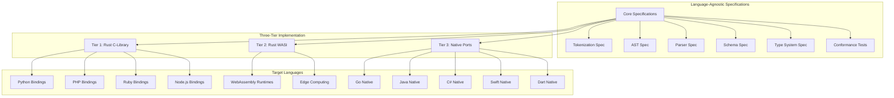
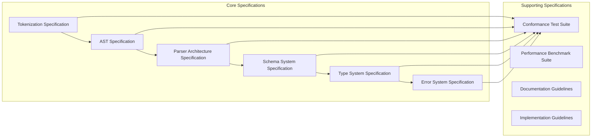
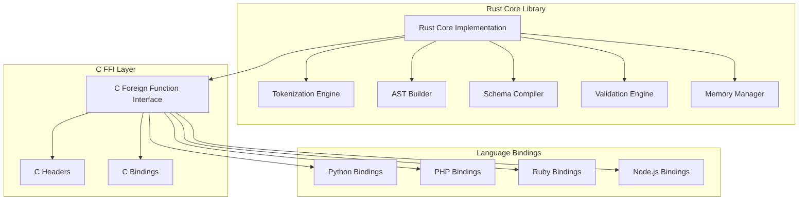
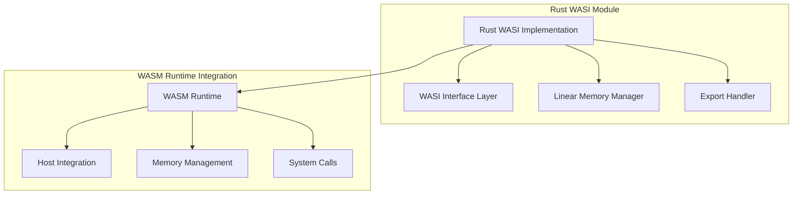
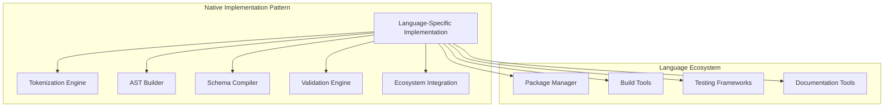
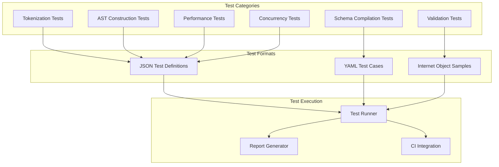

# Design Document

## Overview

This design document outlines the architecture for creating comprehensive language-agnostic specifications for Internet Object and implementing a multi-language ecosystem using a three-tier strategy. The design focuses on establishing language-independent specifications for all core components while ensuring extreme performance, thread safety, and AI-agent maintainability across all implementations.

## Architecture

### High-Level Architecture



### Core Specification Architecture

The language-agnostic specifications form the foundation of the entire ecosystem:



## Components and Interfaces

### 1. Language-Agnostic Core Specifications

#### 1.1 Tokenization Specification
**Purpose**: Define exact tokenization behavior for all Internet Object syntax elements

**Key Components**:
- **Token Types**: Complete enumeration of all token types (identifiers, literals, operators, delimiters)
- **State Machine**: Formal state machine definition for tokenization process
- **Character Handling**: UTF-8 processing, escape sequences, whitespace handling
- **Error Conditions**: Tokenization error types and recovery strategies

**Interface Definition**:
```
TokenizationEngine:
  - tokenize(input: UTF8String) -> TokenStream
  - getTokenType(position: Position) -> TokenType
  - handleError(error: TokenizationError) -> RecoveryAction
```

#### 1.2 AST Specification
**Purpose**: Define Abstract Syntax Tree structure and construction rules

**Key Components**:
- **Node Types**: Complete hierarchy of AST node types (Document, Section, Object, Array, Value)
- **Construction Rules**: Rules for building AST from token streams
- **Traversal Patterns**: Standard patterns for AST traversal and manipulation
- **Validation Rules**: AST structural validation requirements

**Interface Definition**:
```
ASTBuilder:
  - buildAST(tokens: TokenStream) -> ASTNode
  - validateStructure(node: ASTNode) -> ValidationResult
  - traverse(node: ASTNode, visitor: NodeVisitor) -> void
```

#### 1.3 Parser Architecture Specification
**Purpose**: Define the complete parsing pipeline and component interactions

**Key Components**:
- **Parsing Phases**: Tokenization → AST Building → Schema Compilation → Validation → Object Construction
- **State Management**: Parser state handling and context management
- **Error Recovery**: Error handling and recovery strategies
- **Memory Management**: Memory allocation patterns and optimization strategies

**Interface Definition**:
```
ParserEngine:
  - parse(input: UTF8String, schema?: CompiledSchema) -> ParseResult
  - parseWithDefinitions(input: UTF8String, definitions: Definitions) -> ParseResult
  - validateSyntax(input: UTF8String) -> SyntaxValidationResult
```

#### 1.4 Schema System Specification
**Purpose**: Define schema compilation, validation, and runtime behavior

**Key Components**:
- **Schema Compilation**: Process for compiling Internet Object schemas into optimized runtime representations
- **Validation Engine**: Algorithms for validating data against compiled schemas
- **Type Resolution**: Type lookup and resolution mechanisms
- **Constraint Handling**: Validation constraint processing and evaluation

**Interface Definition**:
```
SchemaCompiler:
  - compile(schemaSource: UTF8String) -> CompiledSchema
  - validate(data: ParsedData, schema: CompiledSchema) -> ValidationResult
  - resolveType(typeName: String, context: TypeContext) -> TypeDefinition
```

#### 1.5 Type System Specification
**Purpose**: Define built-in types, validation rules, and extension mechanisms based on Internet Object's actual type system

**Key Components**:
- **Built-in Types**: Complete specification of Internet Object's type system
  - **Primitive Types**: string, number (int, uint, float, bigint), bool, datetime/date/time, decimal
  - **Complex Types**: object, array, any
  - **Derived Types**: email, url, size-specific integers (int8, int16, int32, etc.)
- **Validation Algorithms**: Type-specific validation with constraint checking
- **Decimal Arithmetic**: High-precision decimal operations with RDBMS-compliant behavior
- **Schema Compilation**: Transform schema definitions into optimized validation structures
- **Type Registry**: Pluggable type system with custom type support

**Interface Definition**:
```
TypedefRegistry:
  - register(typeDef: TypeDef) -> void
  - get(typeName: String) -> TypeDef?
  - has(typeName: String) -> Boolean

TypeDef Interface:
  - type: String                           // Type identifier
  - schema: Schema                         // Type's validation schema
  - parse(node: Node, memberDef: MemberDef, defs?: Definitions) -> Any
  - stringify(value: Any, memberDef: MemberDef) -> String

Built-in Type Definitions:
  StringDef:
    - types: ["string", "url", "email"]
    - validation: pattern matching, length constraints, format validation
    - constraints: choices, pattern, flags, len, minLen, maxLen, format, escapeLines
    
  NumberDef:
    - types: ["number", "int", "uint", "float", "bigint", "int8", "int16", "int32", "uint8", "uint16", "uint32", "uint64", "float32", "float64"]
    - validation: range checking, type-specific bounds
    - constraints: min, max, choices, format (decimal, hex, octal, binary, scientific)
    
  DecimalDef:
    - types: ["decimal"]
    - validation: precision/scale constraints, high-precision arithmetic
    - constraints: precision, scale, min, max, choices
    - operations: add, sub, mul, div, mod with RDBMS compliance
    
  BooleanDef:
    - types: ["bool"]
    - validation: boolean value checking
    - constraints: default value
    
  DateTimeDef:
    - types: ["datetime", "date", "time"]
    - validation: date/time format parsing, range checking
    - constraints: min, max, choices
    
  ArrayDef:
    - types: ["array"]
    - validation: element type validation, length constraints
    - constraints: of (element type), len, minLen, maxLen
    
  ObjectDef:
    - types: ["object"]
    - validation: schema-based object validation
    - constraints: schema definition, additional properties handling
    
  AnyDef:
    - types: ["any"]
    - validation: flexible validation with anyOf constraints
    - constraints: choices, anyOf (union types), isSchema
```

### 2. Three-Tier Implementation Architecture

#### 2.1 Tier 1: Rust C-Library Implementation
**Target Languages**: Python, PHP, Ruby, Node.js, Perl, Lua

**Architecture**:


**Key Design Decisions**:
- **Memory Safety**: Rust's ownership system ensures memory safety across FFI boundaries
- **Zero-Copy Operations**: String slices and references minimize memory allocation
- **Thread Safety**: Immutable data structures and lock-free algorithms
- **Error Handling**: Structured error types that translate cleanly across language boundaries

#### 2.2 Tier 2: WASI Implementation
**Target Environments**: WebAssembly runtimes, edge computing, sandboxed environments

**Architecture**:


**Key Design Decisions**:
- **WASI Compliance**: Full compliance with WASI specification for portability
- **Memory Constraints**: Efficient memory usage within WebAssembly linear memory model
- **Host Integration**: Clean integration with host language ecosystems
- **Security**: Sandboxed execution with controlled system access

#### 2.3 Tier 3: Native Implementations
**Target Languages**: Go, Java, C#, Swift, Dart, Kotlin, Scala

**Architecture Pattern**:


**Key Design Decisions**:
- **Idiomatic Code**: Follow language-specific conventions and best practices
- **Performance Optimization**: Language-specific performance optimizations
- **Ecosystem Integration**: Deep integration with language tooling and frameworks
- **Maintainability**: Clear separation of concerns and modular architecture

## Data Models

### 1. Core Data Structures

#### 1.1 Internet Object Core Types
Based on the TypeScript implementation, Internet Object has the following core data structures:

```
IOObject<T>:
  - items: Array<[String?, T]?>  // Ordered key-value pairs with optional keys
  - keyMap: Map<String, Integer> // Fast key lookup to index mapping
  - Methods: set, get, push, delete, forEach, map, filter, etc.
  - Supports both keyed and keyless (positional) members
  - Maintains insertion order
  - Provides array-like and object-like access patterns

IOCollection<T>:
  - items: Array<T>              // Collection of items (typically IOObjects)
  - Methods: push, getAt, setAt, deleteAt, map, filter, forEach, etc.
  - Supports iteration and functional operations
  - Provides indexed access with bounds checking

IODocument:
  - header: IOHeader             // Contains definitions and metadata
  - sections: IOSectionCollection? // Multiple data sections
  - Methods: toJSON, toObject

IODefinitions:
  - definitions: Map<String, IODefinitionValue> // Schema and variable definitions
  - defaultSchema: Schema?       // Default schema if defined
  - Methods: get, getV (variable resolution), set, merge
  - Supports variables (@var), schemas ($schema), and regular definitions
  - Maintains definition order for proper reference resolution

IOSection:
  - name: String?                // Optional section name
  - schema: Schema?              // Section schema
  - data: IOObject | IOCollection // Section data
```

#### 1.2 Value Types System
Internet Object supports a comprehensive type system:

```
PrimitiveTypes:
  - String: "string", "url", "email"
  - Number: "number", "int", "uint", "float", "bigint", "decimal"
    - Size-specific: "int8", "int16", "int32", "uint8", "uint16", "uint32", "uint64"
    - Float types: "float32", "float64"
  - Boolean: "bool"
  - DateTime: "datetime", "date", "time"
  - Null: null values with optional/nullable constraints

ComplexTypes:
  - Object: Structured objects with schema validation
  - Array: Homogeneous collections with element type constraints
  - Any: Flexible type with optional constraints (anyOf, choices)

SpecialTypes:
  - Decimal: High-precision decimal arithmetic with configurable precision/scale
    - coefficient: BigInt (scaled integer representation)
    - exponent: Integer (decimal places)
    - precision: Integer (total significant digits)
    - scale: Integer (fractional digits)
    - Operations: add, sub, mul, div, mod with RDBMS-compliant behavior
```

#### 1.3 Schema System Data Structures
```
Schema:
  - name: String                 // Schema identifier
  - names: Array<String>         // Ordered member names (positional)
  - defs: Map<String, MemberDef> // Member definitions
  - open: Boolean | MemberDef    // Additional properties handling
  - Methods: compile, validate, process

MemberDef:
  - type: String                 // Type name (string, number, object, etc.)
  - optional: Boolean?           // Optional member flag
  - null: Boolean?               // Nullable flag
  - default: Any?                // Default value
  - constraints: TypeConstraints // Type-specific validation rules
  - path: String?                // Member path for error reporting

TypeConstraints (by type):
  String:
    - choices: Array<String>?    // Enumerated values
    - pattern: String?           // Regex pattern
    - flags: String?             // Regex flags
    - len: Integer?              // Exact length
    - minLen: Integer?           // Minimum length
    - maxLen: Integer?           // Maximum length
    - format: String?            // String format (auto, open, regular, raw)
    
  Number:
    - min: Number?               // Minimum value
    - max: Number?               // Maximum value
    - choices: Array<Number>?    // Enumerated values
    - format: String?            // Number format (decimal, hex, octal, binary, scientific)
    
  Decimal:
    - precision: Integer?        // Total significant digits
    - scale: Integer?            // Fractional digits
    - min: Decimal?              // Minimum value
    - max: Decimal?              // Maximum value
    
  Array:
    - of: MemberDef | Schema     // Element type definition
    - len: Integer?              // Exact length
    - minLen: Integer?           // Minimum length
    - maxLen: Integer?           // Maximum length
    
  Object:
    - schema: Schema?            // Object schema definition
    
  DateTime:
    - min: Date?                 // Minimum date/time
    - max: Date?                 // Maximum date/time
    - choices: Array<Date>?      // Enumerated values

TypedefRegistry:
  - types: Map<String, TypeDef> // Registered type definitions
  - Methods: register, get, has
  - Built-in types: AnyDef, ArrayDef, BooleanDef, NumberDef, ObjectDef, StringDef, DateTimeDef

TypeDef Interface:
  - type: String                // Type identifier
  - schema: Schema              // Type's own schema definition
  - parse(node, memberDef, defs): Any // Parse and validate value
  - stringify(value, memberDef): String // Serialize value
```

#### 1.4 Token and AST Representation
```
Token:
  - type: TokenType
  - value: String
  - position: Position
  - Methods: toValue, toString

Position:
  - line: Integer
  - column: Integer
  - offset: Integer

TokenType: Enumeration
  - STRING, NUMBER, BOOLEAN, NULL, DATETIME
  - IDENTIFIER, COMMA, COLON, DOT
  - LEFT_BRACE, RIGHT_BRACE, LEFT_BRACKET, RIGHT_BRACKET
  - SECTION_SEPARATOR (---)
  - DEFINITION_PREFIX (~)
  - EOF

ASTNode Hierarchy:
  Node (Abstract):
    - position: Position
    - children: Array<Node>
    - Methods: toValue, toString
    
  TokenNode extends Node:
    - type: TokenType
    - value: Any (parsed value)
    
  ObjectNode extends Node:
    - members: Array<MemberNode>
    
  ArrayNode extends Node:
    - elements: Array<Node>
    
  MemberNode extends Node:
    - key: TokenNode?
    - value: Node
    
  CollectionNode extends Node:
    - items: Array<ObjectNode>
```

### 2. Performance-Optimized Data Structures

#### 2.1 Zero-Copy String Handling
```
StringSlice:
  - source: ImmutableString
  - start: Integer
  - length: Integer
  - hash: Integer (cached)

StringPool:
  - internedStrings: Map<String, StringHandle>
  - addString(value: String) -> StringHandle
  - getString(handle: StringHandle) -> String
```

#### 2.2 Lock-Free Collections
```
ImmutableList<T>:
  - elements: Array<T>
  - size: Integer
  - append(element: T) -> ImmutableList<T>
  - get(index: Integer) -> T

ConcurrentHashMap<K, V>:
  - buckets: Array<AtomicReference<Bucket<K, V>>>
  - put(key: K, value: V) -> V?
  - get(key: K) -> V?
```

## Error Handling

### Error Code Standardization

All implementations must use standardized error codes based on Internet Object's actual error system:

```
GeneralErrorCodes:
  - invalid-type: Invalid type specification or type mismatch
  - invalid-value: Value doesn't meet validation criteria
  - value-required: Required value is missing
  - null-not-allowed: Null value provided where not allowed

TokenizationErrorCodes:
  - string-not-closed: Unterminated string literal
  - invalid-escape-sequence: Invalid escape sequence in string
  - unsupported-annotation: Unsupported string annotation
  - invalid-datetime: Invalid date/time format

ParsingErrorCodes:
  - unexpected-token: Token not expected in current context
  - expecting-bracket: Missing required bracket or brace
  - unexpected-positional-member: Positional member in wrong context
  - invalid-key: Invalid object key format
  - invalid-schema: Schema definition is malformed
  - schema-not-found: Referenced schema doesn't exist
  - schema-missing: Required schema is missing
  - empty-memberdef: Member definition is empty
  - invalid-definition: Definition syntax is invalid
  - invalid-memberdef: Member definition is malformed
  - invalid-schema-name: Schema name format is invalid
  - variable-not-defined: Referenced variable is not defined
  - schema-not-defined: Referenced schema is not defined

ValidationErrorCodes:
  - invalid-object: Value is not a valid object
  - unknown-member: Object contains unknown member
  - duplicate-member: Object contains duplicate member
  - additional-values-not-allowed: Additional properties not permitted
  - invalid-array: Value is not a valid array
  - not-an-array: Expected array but got different type
  - not-a-string: Expected string but got different type
  - invalid-email: String is not a valid email address
  - invalid-url: String is not a valid URL
  - invalid-length: Value length doesn't match required length
  - invalid-min-length: Value is shorter than minimum length
  - invalid-max-length: Value is longer than maximum length
  - invalid-pattern: Value doesn't match required pattern
  - unsupported-number-type: Number type is not supported
  - not-a-number: Expected number but got different type
  - not-an-integer: Expected integer but got different type
  - out-of-range: Value is outside allowed range
  - invalid-range: Range specification is invalid
  - not-a-bool: Expected boolean but got different type
  - invalid-choice: Value is not in allowed choices
```

### Error Context Information

```
ErrorContext:
  - errorCode: ErrorCode
  - message: String
  - position: Position
  - sourceContext: String (surrounding text)
  - suggestions: List<String>
  - relatedErrors: List<ErrorContext>
```

## Testing Strategy

### 1. Conformance Test Suite Architecture



### 2. Test Case Structure

```json
{
  "testSuite": "tokenization",
  "version": "1.0.0",
  "tests": [
    {
      "id": "token_001",
      "name": "Basic identifier tokenization",
      "input": "name, age, email",
      "expectedTokens": [
        {"type": "Identifier", "value": "name", "position": {"line": 1, "column": 1}},
        {"type": "Comma", "value": ",", "position": {"line": 1, "column": 5}},
        {"type": "Identifier", "value": "age", "position": {"line": 1, "column": 7}}
      ]
    }
  ]
}
```

### 3. Performance Benchmark Specifications

```json
{
  "benchmarkSuite": "parsing_performance",
  "requirements": {
    "minObjectsPerSecond": 1000000,
    "maxMemoryUsageMB": 100,
    "maxLatencyMs": 1
  },
  "benchmarks": [
    {
      "name": "simple_objects",
      "description": "Parse simple objects with basic types",
      "iterations": 1000000,
      "inputSize": "small",
      "expectedThroughput": ">= 1M ops/sec"
    }
  ]
}
```

## Implementation Guidelines

### 1. Tier-Specific Guidelines

#### 1.1 Rust C-Library Guidelines
- Use `#[no_mangle]` for C FFI functions
- Implement proper error handling across FFI boundaries
- Use `Box::leak()` for memory management across language boundaries
- Provide comprehensive C header files with documentation

#### 1.2 WASI Guidelines
- Implement WASI-compliant system interfaces
- Use efficient memory management within linear memory constraints
- Provide WebAssembly-optimized data structures
- Support streaming operations for large documents

#### 1.3 Native Implementation Guidelines
- Follow language-specific coding conventions and style guides
- Use language-native error handling mechanisms (exceptions, Result types, etc.)
- Integrate with language-specific testing frameworks
- Provide idiomatic APIs that feel natural to language users

### 2. AI-Agent Maintainability Patterns

#### 2.1 Standardized Project Structure
```
internet-object-{language}/
├── src/
│   ├── core/           # Core parsing logic
│   ├── schema/         # Schema compilation
│   ├── validation/     # Validation engine
│   ├── types/          # Type system
│   └── bindings/       # Language-specific bindings (if applicable)
├── tests/
│   ├── conformance/    # Shared conformance tests
│   ├── unit/           # Unit tests
│   ├── integration/    # Integration tests
│   └── performance/    # Performance benchmarks
├── docs/
│   ├── api/            # API documentation
│   ├── examples/       # Usage examples
│   └── implementation/ # Implementation notes
└── tools/
    ├── codegen/        # Code generation tools
    ├── testing/        # Testing utilities
    └── benchmarks/     # Benchmark tools
```

#### 2.2 Interface Standardization
All implementations must provide consistent interfaces that AI agents can recognize and maintain:

```
// Core Parser Interface (language-agnostic concept)
Parser:
  - parse(input: String) -> Result<Document, Error>
  - parseWithSchema(input: String, schema: Schema) -> Result<Document, Error>
  - validate(input: String) -> Result<ValidationReport, Error>

// Schema Compiler Interface
SchemaCompiler:
  - compile(schemaSource: String) -> Result<CompiledSchema, Error>
  - validate(schema: String) -> Result<ValidationReport, Error>

// Document Interface
Document:
  - getSections() -> List<Section>
  - toJSON() -> String
  - serialize() -> String
```

This design ensures that AI agents can:
1. Recognize consistent patterns across all implementations
2. Apply updates systematically across languages
3. Validate changes using the conformance test suite
4. Generate language-specific code from shared specifications

The architecture prioritizes specification-driven development, ensuring that all implementations conform to identical behavioral standards while allowing for language-specific optimizations and ecosystem integration.