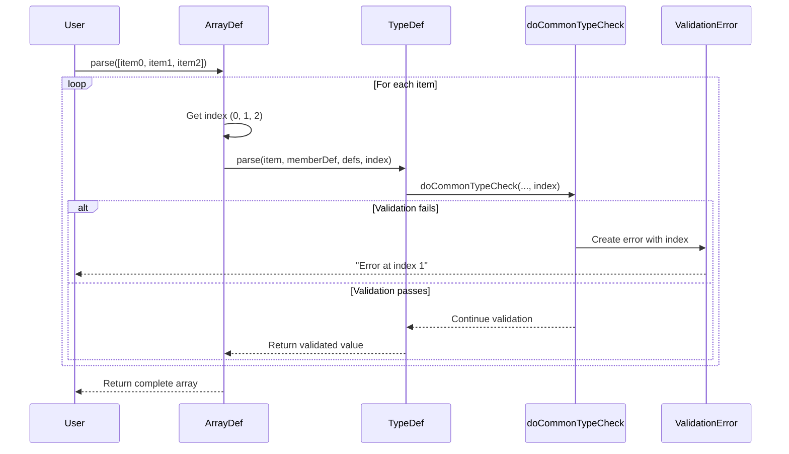

[text](../../../QUICK-REFERENCE.md)# CollectionIndex Parameter - Analysis & Use Cases

## Current State

The `collectionIndex` parameter is currently:
- ✅ Defined in the `TypeDef` interface signature
- ✅ Passed through the call chain (processObject → processMember → TypeDef.parse)
- ✅ Used in `common-type.ts` for error messages (2 places)
- ❌ **NOT passed to array items** - Arrays call `typeDef.parse(item, arrayMemberDef, defs)` without index
- ❌ **NOT consistently used** across all TypeDefs

## Current Usage

### Location 1: `common-type.ts` - Value Required Error
```typescript
function _valueRequired(memberDef: MemberDef, node?: Node, collectionIndex?: number): ErrorArgs {
  const msg = `Value is required for ${memberDef.path}` +
    (collectionIndex !== undefined ? ` at index ${collectionIndex}` : '')
  return [ErrorCodes.valueRequired, msg, node]
}
```

### Location 2: `common-type.ts` - Null Not Allowed Error
```typescript
if (isNull) {
  if (memberDef.null) return { value: null, changed: true }
  const msg = `Null is not allowed for ${memberDef.path}` +
    (collectionIndex !== undefined ? ` at index ${collectionIndex}` : '')
  throw new InternetObjectValidationError(ErrorCodes.nullNotAllowed, msg, node)
}
```

## Problem: Array Items Don't Pass Index

```typescript
// In array.ts - MISSING collectionIndex!
valueNode.children.forEach((item: any, index: number) => {
  array.push(typeDef?.parse(item, arrayMemberDef, defs))
  //                                                    ^^^ Should be: defs, index
})
```

## Proposed Use Cases

### 1. ✅ **Enhanced Error Messages** (PRIMARY USE CASE)

When validating array items, include the index in error messages:

```typescript
// Current error (vague)
"Value is required for users.email"

// With collectionIndex (specific)
"Value is required for users.email at index 3"

// Even better with path composition
"Value is required for users[3].email"
```

**Benefit**: Helps developers quickly locate which array item has the issue.

### 2. ✅ **Contextual Validation Rules**

Some validations might need to know their position:

```typescript
// Example: First item must be different from others
class CustomValidator {
  validate(value: any, memberDef: MemberDef, collectionIndex?: number) {
    if (collectionIndex === 0) {
      // Special validation for first item
      if (value === 'default') {
        throw new Error('First item cannot be "default"')
      }
    }
  }
}
```

**Use Cases**:
- First/last item special rules
- Even/odd index validation
- Index-based constraints (e.g., "every 5th item must be X")

### 3. ✅ **Better Debugging Information**

Include index in all error metadata:

```typescript
class ValidationError {
  constructor(
    code: string,
    message: string,
    node?: Node,
    options?: {
      path?: string,
      collectionIndex?: number  // Add to error metadata
    }
  ) {
    // ...
  }

  toJSON() {
    return {
      code: this.code,
      message: this.message,
      path: this.path,
      collectionIndex: this.collectionIndex,  // Available for tooling
      line: this.line,
      column: this.column
    }
  }
}
```

**Benefit**: IDE extensions, linters, and debugging tools can highlight exact array items.

### 4. ✅ **Path Composition for Nested Structures**

Build precise paths for nested arrays:

```typescript
// Current: "users.addresses.street"
// Better:  "users[2].addresses[0].street"

function composePath(basePath: string, collectionIndex?: number): string {
  if (collectionIndex !== undefined) {
    return `${basePath}[${collectionIndex}]`
  }
  return basePath
}

// Usage in ArrayDef
valueNode.children.forEach((item: any, index: number) => {
  const itemMemberDef = {
    ...arrayMemberDef,
    path: composePath(memberDef.path, index)
  }
  array.push(typeDef?.parse(item, itemMemberDef, defs, index))
})
```

### 5. ✅ **Validation Statistics & Reporting**

Track which array indices have issues:

```typescript
interface ValidationReport {
  totalItems: number
  validItems: number
  errors: Array<{
    path: string
    index: number
    error: ValidationError
  }>
}

// Usage
const report = validator.validateArray(items, schema)
console.log(`Items with errors: ${report.errors.map(e => e.index).join(', ')}`)
// Output: "Items with errors: 2, 7, 15"
```

### 6. ⚠️ **Performance Profiling** (Optional)

Track validation time per array index:

```typescript
class PerformanceTracker {
  trackValidation(index: number, duration: number) {
    // Identify slow array items
    if (duration > threshold) {
      console.warn(`Validation slow at index ${index}: ${duration}ms`)
    }
  }
}
```

### 7. ✅ **Bulk Operations with Partial Success**

Know which items succeeded/failed:

```typescript
interface LoadResult {
  success: any[]
  failed: Array<{ index: number, error: Error, originalValue: any }>
}

function loadArrayPartial(items: any[], schema: Schema): LoadResult {
  const success = []
  const failed = []

  items.forEach((item, index) => {
    try {
      success.push(typeDef.load(item, memberDef, defs, index))
    } catch (error) {
      failed.push({ index, error, originalValue: item })
    }
  })

  return { success, failed }
}

// Usage
const result = loadArrayPartial(data, schema)
console.log(`Loaded ${result.success.length} items, ${result.failed.length} failed`)
console.log(`Failed indices: ${result.failed.map(f => f.index).join(', ')}`)
```

## Recommendation: KEEP IT ✅

### Reasons to Keep

1. **Already implemented** - Infrastructure is in place
2. **Low cost** - One extra parameter with minimal overhead
3. **High value** - Significantly improves error messages
4. **Future-proof** - Enables advanced use cases
5. **Standard practice** - Common pattern in validation libraries (Joi, Yup, etc.)
6. **Type safe** - Optional parameter, backward compatible

### Required Changes

#### 1. Fix Array Implementation

```typescript
// BEFORE (array.ts)
valueNode.children.forEach((item: any) => {
  array.push(typeDef?.parse(item, arrayMemberDef, defs))
})

// AFTER
valueNode.children.forEach((item: any, index: number) => {
  array.push(typeDef?.parse(item, arrayMemberDef, defs, index))
})
```

#### 2. Enhance Path Composition

```typescript
// In ArrayDef
function _processNode(node: Node, memberDef: MemberDef, defs?: Definitions, collectionIndex?: number) {
  // ... existing code ...

  const array: any = []
  valueNode.children.forEach((item: any, index: number) => {
    // Enhance path to include array index
    const enhancedMemberDef = {
      ...arrayMemberDef,
      path: `${memberDef.path}[${index}]`  // e.g., "users[2]"
    }

    array.push(typeDef?.parse(item, enhancedMemberDef, defs, index))
  })
}
```

#### 3. Update Load/Serialize Signatures

```typescript
interface TypeDef {
  parse(node: Node, memberDef: MemberDef, defs?: Definitions, collectionIndex?: number): any
  load(value: any, memberDef: MemberDef, defs?: Definitions, collectionIndex?: number): any
  serialize(value: any, memberDef: MemberDef, defs?: Definitions, collectionIndex?: number): string
}
```

#### 4. Consistent Usage in All TypeDefs

Ensure all TypeDefs forward `collectionIndex` to `doCommonTypeCheck`:

```typescript
// In StringDef, NumberDef, etc.
parse(node: Node, memberDef: MemberDef, defs?: Definitions, collectionIndex?: number): string {
  const valueNode = defs?.getV(node) || node
  const { value, handled } = doCommonTypeCheck(
    memberDef,
    valueNode,
    node,
    defs,
    collectionIndex  // ✅ Always pass through
  )
  // ...
}
```

## Error Message Examples

### Before (Without collectionIndex)

```
Error: Value is required for users.email
Error: Null is not allowed for orders.items.price
Error: Invalid email address for contacts.email
```

**Problem**: For arrays, you don't know which item failed!

### After (With collectionIndex)

```
Error: Value is required for users[3].email
Error: Null is not allowed for orders.items[7].price at index 7
Error: Invalid email address for contacts[12].email
```

**Better**: Clear indication of which array item has the issue.

### With Enhanced Path Composition

```
Error: Value is required for users[3].email
Error: Null is not allowed for orders[2].items[7].price
Error: Invalid email address for contacts[12].email
Error: Age must be >= 18 for participants[5].age
```

**Best**: Full path including all array indices in nested structures.

## Mermaid Diagram: CollectionIndex Flow



## Alternative: Remove It? ❌

### Reasons NOT to Remove

1. **Loses context** - Can't tell which array item failed
2. **Debugging harder** - Developers need to manually find the bad item
3. **Not future-proof** - Limits advanced use cases
4. **Breaks existing usage** - Already used in 2 places
5. **Regression** - Makes error messages less helpful

### If Removed, Users Would Resort To:

```typescript
// Manual workaround - inefficient!
data.users.forEach((user, index) => {
  try {
    validateUser(user, schema)
  } catch (error) {
    console.error(`Error at index ${index}:`, error)
  }
})
```

## Implementation Priority

### Phase 1: Fix Existing Usage (High Priority)
- [x] Already used in `doCommonTypeCheck` ✅
- [ ] Fix `array.ts` to pass index to child items 🔴
- [ ] Test error messages include index

### Phase 2: Enhance Path Composition (Medium Priority)
- [ ] Update `memberDef.path` to include `[index]`
- [ ] Support nested arrays: `users[2].addresses[0]`
- [ ] Update error messages to show full path

### Phase 3: Extend to Load/Serialize (Medium Priority)
- [ ] Ensure `load()` uses collectionIndex
- [ ] Ensure `serialize()` uses collectionIndex
- [ ] Test all three operations

### Phase 4: Advanced Features (Low Priority)
- [ ] Validation statistics/reporting
- [ ] Partial success handling
- [ ] Performance tracking

## Code Example: Complete Implementation

```typescript
// array.ts - Fixed implementation
function _processNode(node: Node, memberDef: MemberDef, defs?: Definitions, collectionIndex?: number) {
  const valueNode = defs?.getV(node) || node
  const { value, handled } = doCommonTypeCheck(memberDef, valueNode, node, defs, collectionIndex)
  if (handled) return value

  if (!(valueNode instanceof ArrayNode)) {
    throw new ValidationError(ErrorCodes.notAnArray, `Expecting an array value for '${memberDef.path}'`, node)
  }

  // Get item type definition
  const itemTypeDef = getItemTypeDef(memberDef)
  const array: any[] = []

  // ✅ FIXED: Pass index to child items
  valueNode.children.forEach((item: any, index: number) => {
    // Enhance path with array index
    const itemMemberDef = {
      ...arrayMemberDef,
      path: `${memberDef.path}[${index}]`  // e.g., "users[2]"
    }

    try {
      array.push(itemTypeDef.parse(item, itemMemberDef, defs, index))
    } catch (err) {
      // Error already has index in message from doCommonTypeCheck
      if (err instanceof ValidationError && valueNode !== node) {
        err.positionRange = node
      }
      throw err
    }
  })

  // Validate length constraints
  validateLength(array, memberDef, node)
  return array
}
```

## Conclusion

**Recommendation: KEEP `collectionIndex` ✅**

The parameter provides significant value with minimal cost:

- ✅ **Better error messages** - Primary benefit
- ✅ **Already implemented** - Low effort to maintain
- ✅ **Future-proof** - Enables advanced use cases
- ✅ **Industry standard** - Common pattern in validation libraries
- ✅ **Type safe** - Optional parameter, backward compatible

**Action Items**:
1. Fix `array.ts` to pass index to child items (HIGH PRIORITY)
2. Enhance path composition to include `[index]` (MEDIUM PRIORITY)
3. Add tests for error messages with indices (HIGH PRIORITY)
4. Document the parameter usage (MEDIUM PRIORITY)
5. Extend to `load()` and `serialize()` operations (MEDIUM PRIORITY)

---

## Integration With Error Codes & Envelope

The `collectionIndex` parameter now participates in the standardized error envelope emitted during serialization and mixed success parsing. Error metadata unifies code, category, positional info, and path.

### Envelope Shape (Proposed Canonical)

```jsonc
{
  "__error": true,
  "code": "invalid-email",          // From ValidationErrorCodes
  "category": "validation",         // Derived from IOValidationError subclass
  "message": "Invalid email 'alice@@example.com'. Expected format user@domain.tld",
  "path": "users[3].email",          // Composed path with array index
  "collectionIndex": 3,               // Top-level record index
  "position": { "row": 12, "col": 18 },
  "endPosition": { "row": 12, "col": 39 }
}
```

### Code Selection Guidelines

| Scenario | Use Code | Notes |
|----------|----------|-------|
| Missing required member | `value-required` | General error (validation context) |
| Null not allowed | `null-not-allowed` | General error (validation context) |
| Type mismatch string | `not-a-string` | Prefer specific over `invalid-type` |
| Email pattern failure | `invalid-email` | Pattern-specific clarity |
| Choice violation | `invalid-choice` | Include allowed list in message |
| Range violation | `out-of-range` OR `invalid-range` | `out-of-range` for runtime values, `invalid-range` for schema definition mistakes |

### CollectionIndex vs Path

| Field | Purpose | Nested Arrays |
|-------|---------|---------------|
| `collectionIndex` | External ordering of top-level collection items | Not incremented for nested arrays |
| `path` | Precise address with embedded indices | Includes all nested array indices (e.g. `orders[2].items[7].price`) |

Nested arrays DO NOT set a separate `collectionIndex`; their position is only in the `path` segments.

### Example: Mixed Success Collection

Input (conceptual):
```io
users:{name, email}
---
~ Alice, alice@example.com
~ Bob, bob@@example.com      # invalid email
~ Carol, carol@example.com
~ Dave,                      # missing email
```

Serialized Array (partial):
```jsonc
[
  { "name": "Alice", "email": "alice@example.com" },
  {
    "__error": true,
    "code": "invalid-email",
    "category": "validation",
    "message": "Invalid email 'bob@@example.com'. Expected format user@domain.tld",
    "path": "users[1].email",
    "collectionIndex": 1
  },
  { "name": "Carol", "email": "carol@example.com" },
  {
    "__error": true,
    "code": "value-required",
    "category": "validation",
    "message": "Value is required for users[3].email",
    "path": "users[3].email",
    "collectionIndex": 3
  }
]
```

### Implementation Hooks

1. Array processing must compose `memberDef.path` with `[index]` before invoking child type parsing.
2. `doCommonTypeCheck` ALWAYS receives `collectionIndex` to enrich required/null error messages.
3. Error envelope builder (planned utility) should read `error.errorCode`, infer category from instance type, and attach `collectionIndex` if present in invocation chain.
4. Position data integrated via `error-range-utils` to set `positionRange` early; serialization splits `start/end` for UI.

### Testing Checklist

- [ ] Error objects preserve ordering relative to successful items.
- [ ] `collectionIndex` matches original input ordering for ALL error cases.
- [ ] `path` includes all nested indices (e.g., `addresses[2].lines[0]`).
- [ ] Specific codes used (no fallback to `invalid-type`).
- [ ] Messages include actionable guidance (see ERROR-HANDLING-GUIDELINES.md).

### Future Enhancements

1. Add `hint` field for automatic remediation suggestions (e.g., nearest valid choice).
2. Embed `constraints` object for range/pattern violations (min, max, regex).
3. Optional `severity` field (`error|warning|info`) for soft validations.
4. Multi-error aggregation per item (`errors: []`) when enabling deep validation mode.

Refer to `docs/errors/ARCHITECTURE-ERROR-HANDLING.md` for the broader system and `docs/errors/ERROR-CODE-REGISTRY.md` for authoritative code listings.


---

**Document Version**: 1.0
**Date**: November 18, 2025
**Decision**: KEEP ✅
